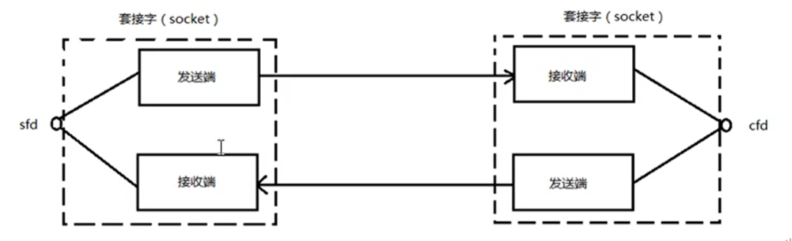
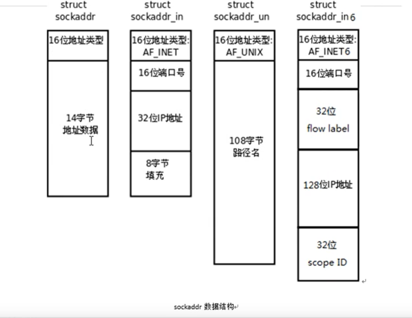

# Socket


#### 一、网络套接字

1. 套接字的通信原理如图：
   - 
   - 在网络通信中，一个文件描述符指向一个套接字（该套接字内部由内核借助两个缓冲区实现）

#### 二、网络字节序

1. 小端法（pc本地存储）：高位存高地址，低位存低地址。

2. 大端法（网络存储）：高位存低地址，低位存高地址。

3. 可以调用以下库函数做网络字节序和主机字节序的转换

   - ```
     uint32_t htonl(uint32_t hostlong);//本地字节序转网络字节序32位（Ip）
     uint16_t htons(uint16_t hostshort);//本地字节序转网络字节序16位（Port）
     uint32_t ntohl(uint32_t netlong);
     uint16_t ntohs(uint16_t netshort); 
     ```

   - h表示host，n表示network，l表示32位长整数，s表示16位短整数

#### 三、IP地址转换函数

1. ```
   #include <arpa/inet.h>
   //af:当前使用的ip协议类型（AF_INET,AF_INET6）
   //src:ip地址（点分十进制）
   //dst:传出，转换后的网络字节序的IP地址
   //返回值:成功返回1;异常返回0,src此时指向的不是一个有效的ip地址;失败返回-1
   int inet_pton(int af,const char *src,void *dst);
   
   //af:当前使用的ip协议类型（AF_INET,AF_INET6）
   //src:网络字节序的ip地址
   //dst:传出，转换后的本地字节序的IP地址
   //size:dst的大小
   //返回值:成功dst;失败NULL
   const char *inet_ntop(int af,const void *src,char *dst,socklen_t size);
   ```

#### 四、sockaddr地址结构

1. sockaddr的数据结构

   - 
   - sockaddr_in是ipv4,sockaddr_in6是ipv6
   - 定义个struct sockaddr_in add，然后强转为(struct sockaddr*)&add
   - 初始化sockaddr_in 结构体的成员
     - addr.sin_family = AF_INET;
     - addr.sin_port = htons(9527);
     - int dst;
     -  inet_pton(AF_INET,"192.157.22.45",void(*)&dst)
     - addr.sin_addr.s_addr = dst;
     - addr.sin_addr.s_addr = htol(INADDR_ANY); //取出系统中有效的任意IP地址。默认整型（二进制）
     - bind(fd,(struct sockaddr*)&add,size); //size是dst的大小

2. struct sockaddr_in的成员

   - 

   - 

   

   