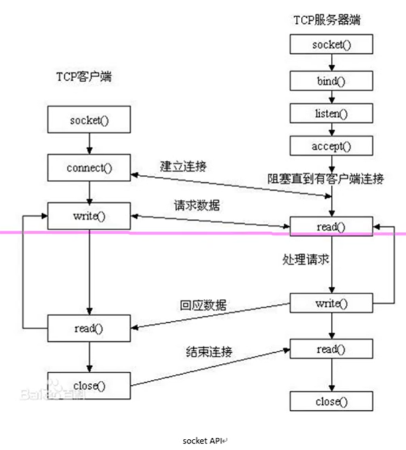

# socket模型创建流程分析

#### 一、流程模型

1. 
   - 服务端
     - socket()，产生一个套接字，会有一个句柄fd，作为套接字的唯一入口。
     - bind()，绑定套接字的ip和port。
     - listen()，设置监听上限，同时建立连接数。没有阻塞作用。
     - accept()，阻塞，监听客户端连接。然后会返回一个新的socket。
   - 客户端
     - socket()，创建一个套接字。
     - connect()，绑定ip和port。
2. socket函数
   - 头文件：#include <sys/socket.h>
   - int socket(int domain,int type,int protocol);//创建套接字
     - domain是所选的ip协议，AF_INET、AF_INET6、AF_UNIX
     - type：SOCK_STREAM(流式)，SOCK_DGRAM(报式)
     - protocol：0（根据类型选择协议），比如流式协议代表的报文是tcp，报式协议的代表报文是udp
     - 返回值：成功返回新套接字所对应的文件描述符，失败返回-1 errno
3. bind函数
   - 头文件：#include <arpa/inet.h>
   - int bind(int sockfd, const struct sockaddr *addr, socklen_t addrlen);//给socket绑定一个地址结构（IP+port）
     - sockfd：socked函数返回值
     - addr：传入参数
       - struct sockaddr_in add
       - addr.sin_family = AF_INET;
       - addr.sin_port = htons(9527);
       - addr.sin_addr.s_addr = htol(INADDR_ANY); //取出系统中有效的任意IP地址。默认整型（二进制）
       - addr：(struct sockaddr *)&addr
     - addrlen：sizeof(addr)地址结构的大小
     - 返回值：成功返回0，失败返回-1
4. listen函数
   - int linsten(int sockfd, int backlog);//设置同时与服务器建立连接的上限数（同时进行三次握手的客户端的数量）
     - sockfd：socket函数的返回值
     - backlog：同时建立链接上限数值
     - 返回值：成功0，失败-1
5. accept函数
   - int accept(int sockfd, struct sockaddr *addr, socklen_t *addrlen);//阻塞等待客户端建立链接，成功的话，返回一个与客户端成功连接的socket文件描述符。
     - sockfd：socket函数的返回值
     - addr：传出参数。传出成功与服务端建立连接的那个客户端的地址结构（IP+port）
     - addrlen：传入传出。入时是addr的大小，出时是客户端addr的实际大小。
       - socklen_t clit_addr_len = sizeof(addr)
       - &clit_addr_len
     - 返回值：成功：能与服务器进行数据通信的客户端socket对应的文件描述符。失败：-1
6. connect函数
   - int connect(int sockfd, const struct sockaddr *addr, socklen_t addrlne)；//使用现有的socket与服务器建立连接
     - sockfd：soocket函数的返回值
     - addr：传入参数，服务器的地址结构，服务器地址结构的大小
     - 返回值：成功0，失败-1
       - 如果不使用bind绑定客户端地址结构，采用“隐式绑定”。		